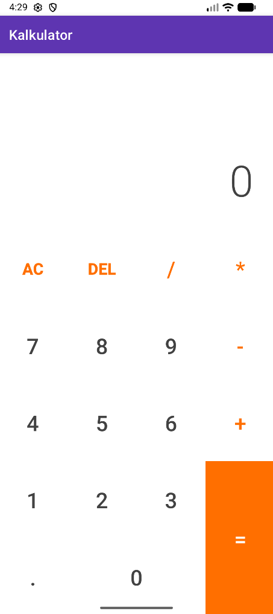

# Kalkulator

Jednostavna Android kalkulator aplikacija rađena u Kotlinu za kolegij.

## Što radi?

Obični kalkulator koji zna:
- Zbrajati, oduzimati, množiti i dijeliti
- Raditi s decimalnim brojevima
- Nastaviti računati na rezultatu (ne moraš resetirati nakon svake operacije)

## Kako pokrenuti projekt?

1. Otvori Android Studio
2. File → Open → Odaberi ovaj folder
3. Pričekaj da se Gradle sinkronizira (može potrajati)
4. Pokreni emulator ili spoji mobitel
5. Klikni Run (zeleni trokut ili Shift+F10)

## Kako izgleda?




## Tehnički info

- **Jezik:** Kotlin
- **Min Android verzija:** 7.0 (API 24)
- **Target verzija:** API 36

## Struktura

```
app/
  src/main/
    java/.../MainActivity.kt    ← Tu je sva logika
    res/
      layout/                   ← Izgled ekrana
      values/                   ← Boje, stringovi, stilovi
      drawable/                 ← Slike i pozadine
```

## Što bi se još moglo dodati?

- Zagrade
- Sin, cos, tan, cotan
- Povijest računa
- Dark mode

---

Projekt za kolegij "Razvoj aplikacija za mobilne uređaje", FSRE | 2025

